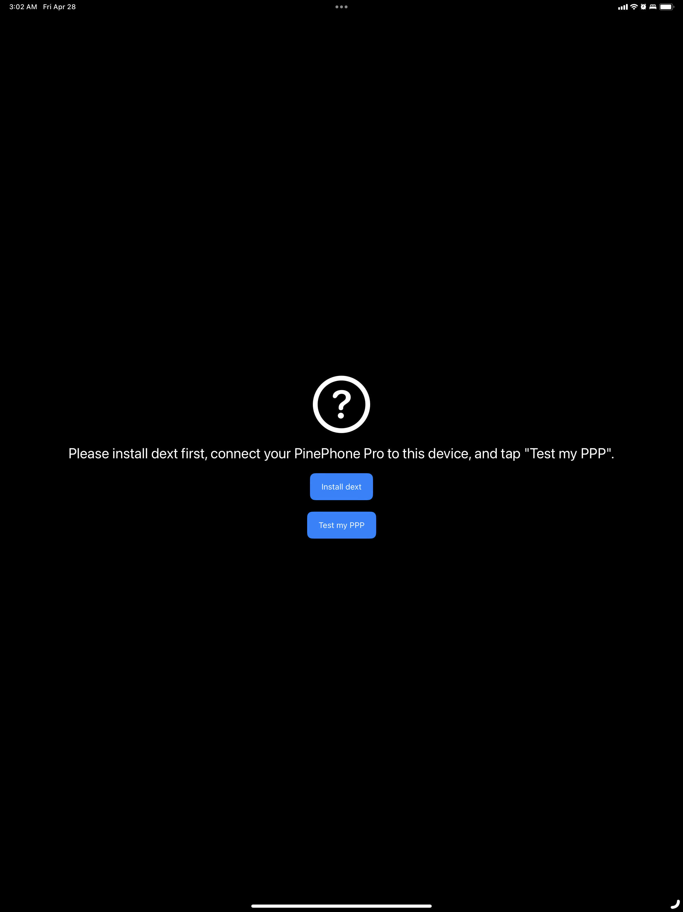

# Maskrom Detector

Maskrom Detector is an iPad app that detects if the connected [PinePhone Pro](https://www.pine64.org/pinephonepro/) is in Maskrom mode. Maskrom mode is often used [when the PPP's battery is fully drained](https://wiki.pine64.org/wiki/PinePhone_Pro#The_battery_is_fully_drained).

This app uses [DriverKit](https://developer.apple.com/documentation/driverkit).

Screenshots:

| Initial State | When in Maskrom mode | When not in Maskrom mode |
|-|-|-|
|  |  |  |
